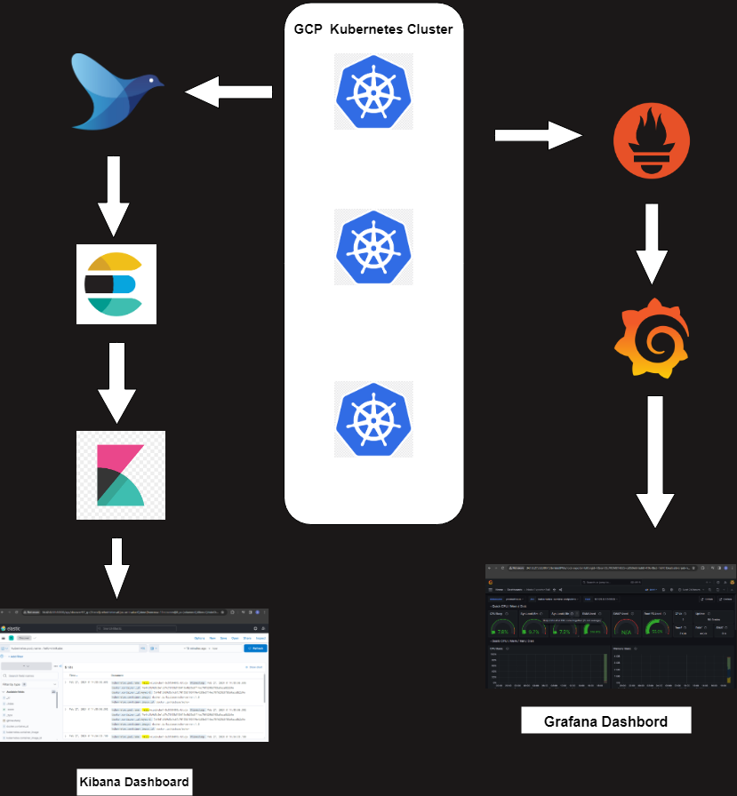

# Monitoring-and-Logging-using-Prometheus-Grafana-and-EFK-Stack
Kubernetes Cluster monitoring and Logging
## Prerequisites 
1. GCP Kubernetes Cluster
2. install helm
```shell
 curl -fsSL -o get_helm.sh https://raw.githubusercontent.com/helm/helm/main/scripts/get-helm-3
 chmod 700 get_helm.sh
 ./get_helm.sh
```
   
## Project Architecture



## EFK Setup:
```shell
cd EFK-setup
kubetc apply -f .
```
